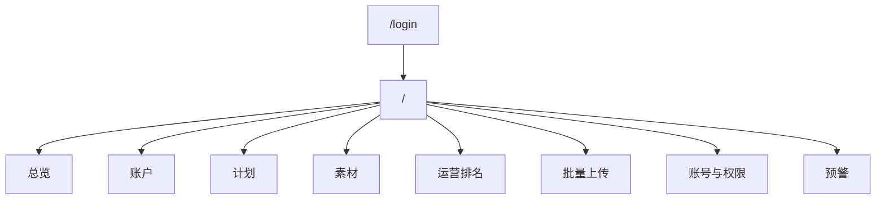

# 02 页面与交互说明

## 1. 页面信息架构

---

## 2. 路由基线

第一阶段统一路由：

- `/login`
- `/`
- `/api/*`

第一阶段不再维护：

- 大屏页 `/screen`
- 独立后台 `/admin`
- 匿名公开首页

---

## 3. 设计原则

1. 风格接近官方工作台，但不追求复杂特效。
2. 桌面优先，重点照顾老板和运营主管。
3. 表格、排序、筛选、侧栏详情优先。
4. 页面刷新后保留排序与筛选状态。
5. 性能优先，不做无意义动画。

### 3.1 细节设计标准

以下标准用于避免后续继续出现“按钮过大、搜索掉第二排、标题重复、留白过多、详情重复字段”等问题：

1. 顶部按钮和状态胶囊必须是辅助信息，不能抢占主标题和数据卡的视觉重心。
2. 桌面宽度下，查询区优先保证：
   - 时间范围
   - 日期范围
   - 搜索框
   - 查询按钮
   尽量保持在同一视觉带内。
3. 搜索框 placeholder 必须简短，只提示主要搜索对象，不枚举所有可命中字段。
4. 模块标题只保留一个主标题；副文案只在确实有新增信息时保留，不能重复标题含义。
5. 横向主表优先展示；计划、素材、运营排名这类以表格为主的模块，不再默认挂右侧详情面板。
6. 表格首列优先展示“名称 + 轻量辅助标识”，辅助信息要弱化，便于快速扫表。
7. 所有可排序列都要有一致的交互反馈；默认排序列要能被快速识别。
8. 空状态、提示条、只读提示必须紧凑，不能制造大面积空白。
9. 管理页表单遵循统一顺序：
   - 目标对象
   - 关键输入
   - 辅助选项
   - 主按钮
10. 同类模块的查询区顺序保持一致，不允许每个页面都使用不同的排序方式。
11. 排名和明细列表的列优先级优先体现经营判断：
   - 先看消耗
   - 再看 ROI / 支付 / 订单
   - 维度说明字段放后

---

## 4. 主看板布局

### 4.1 顶部

- 系统标题
- 当前状态胶囊
- 最近同步状态
- 导航标签
- 轻量操作按钮

目标：

- 头部尽量紧凑
- 不制造无意义留白

### 4.2 总览页

模块顺序：

- 经营主卡
- 活跃度摘要
- 系统状态
- 老板关注

### 4.2A 工作台首页

- 登录后直接进入
- 作为管理员 / 主管 / 运营的统一首页
- 通过角色控制模块可见范围和数据范围
- 不再存在匿名公开榜入口

### 4.3 账户页

- 时间范围 / 指定日期范围
- 排名表格
- 排序
- 搜索
- 核心字段：
  - 账户名称
  - 消耗
  - 支付
  - 订单
  - ROI
  - 账户状态
- 默认按消耗降序
- 所有字段支持表头升序 / 降序
- 统一时间范围：
  - 今日
  - 昨日
  - 近7天
  - 近30天
  - 指定日期范围
- 搜索为模块内全局关键词搜索

### 4.4 经营拆解页

- 商品排名
- 归属人排名
- 时间段切换
- 指定日期范围

### 4.5 计划页

- 计划表格
- 模块内搜索
- 账户筛选
- 核心字段：
  - 计划名称
  - 商品 / 主播
  - 所属账户
  - 订单数
  - ROI
  - 目标 ROI
  - 消耗
  - 支付
  - 投放状态
- 消耗和 ROI 靠前
- 所有字段支持表头升序 / 降序
- 统一时间范围：
  - 今日
  - 昨日
  - 近7天
  - 近30天
  - 指定日期范围
- 搜索为模块内全局关键词搜索

### 4.6 素材页

- 素材榜单
- 视频/素材字段
- 排序和搜索
- 时间段切换
- 指定日期范围
- 核心字段：
  - 素材名称
  - 消耗
  - 订单数
  - 支付
  - ROI
  - 计划数
  - 账户数
- 默认按消耗降序
- 所有字段支持表头升序 / 降序
- 统一时间范围：
  - 今日
  - 昨日
  - 近7天
  - 近30天
  - 指定日期范围
- 搜索为模块内全局关键词搜索

### 4.6A 运营账号排名页

- 运营账号聚合榜单
- 时间段切换
- 指定日期范围
- 核心字段：
  - 运营账号 / 展示名
  - 消耗
  - 订单数
  - 支付
  - ROI
  - 计划数
  - 账户数
- 默认按消耗降序
- 所有字段支持表头升序 / 降序
- 统一时间范围：
  - 今日
  - 昨日
  - 近7天
  - 近30天
  - 指定日期范围
- 搜索为模块内全局关键词搜索

### 4.7 通知规则页

- 渠道设置
- 阈值规则新增
- 已生效规则表
- 账户余额规则
- 共享钱包规则
- 计划消耗规则
- 爆单计划规则

要求：

- 只保留阈值告警相关配置
- 去掉定时报表、简报配置等无关项
- 通知渠道第一阶段只显示：
  - 飞书
  - 钉钉
  - 微信
- 限定对象必须支持关键词搜索后选择候选项
- 前端显示人类可读名称，后端保存真实 ID
- 先把多通知渠道配置结构做完整，实际发送可以后置开启
- 商品爆单作为预留能力，不计入第一阶段已实现范围

### 4.8 账号与权限页

- 运营账号列表
- 账号基础信息编辑
- 主管账户范围配置
- 主管上传素材权限开关
- 运营关键词配置
- 运营命中素材查看入口

要求：

- 默认页面保持简洁
- 不点击某个账号时，不展示命中素材列表
- 点击账号后，才展示该账号的扩展配置和命中素材
- 命中素材列表支持关键词搜索
- 命中逻辑只按素材名称关键词
- 命中素材列表字段至少包含：
  - 素材名称
  - 消耗
  - 所属账户
  - 所属计划

### 4.9 预警页

- 规则编辑器
- 通知渠道
- 已生效规则表
  - 预览入口

---

## 5. 通用交互规则

### 5.1 时间筛选

所有带 `日 / 周 / 月` 的模块统一支持：

- 日
- 昨日
- 近7天
- 近30天
- 指定日期范围

查询区视觉顺序统一为：

- 时间范围按钮
- 日期范围输入
- 条件筛选
- 搜索框
- 查询/刷新按钮

### 5.2 排序

- 点击列头排序
- 自动刷新后保持当前排序方式

### 5.3 搜索与归属

- 搜索只收窄当前结果集
- 不新开第二套“搜索页”
- 员工归属配置页里的搜索结果可直接勾选进入归属关系
- 同一员工可配置多个关键词
- 搜索范围支持：
  - 全部
  - 账户
  - 计划
  - 商品
  - 素材
- 同一关键词命中的账户/计划/商品/素材可人工勾选入员工归属范围

### 5.4 详情

- 优先侧栏或当前页详情
- 不做多层跳转

### 5.5 空值

- 前端统一显示 `--`

---

## 6. 第一阶段不做的页面

- 大屏展示页
- 独立 `/admin` 后台站点
- 多租户配置台
- BI 自定义分析器
