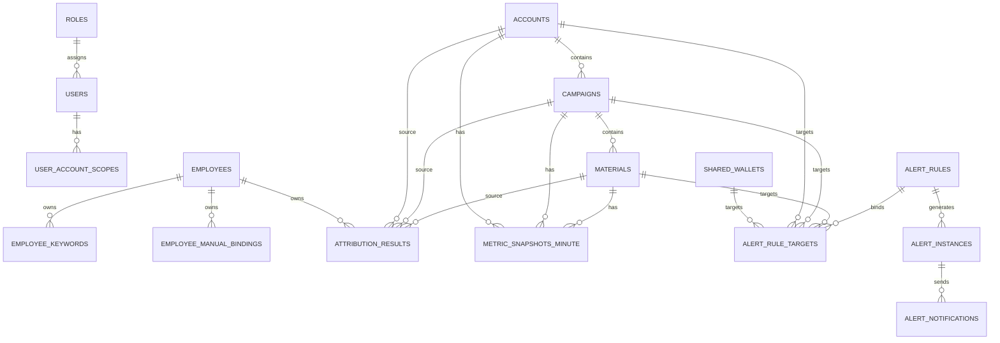

# 04 数据模型与存储设计

## 1. 设计目标

数据层需要同时解决以下问题：

- 保存约 `1000` 个账户规模的结构数据与指标数据
- 支持员工归属规则与人工修正
- 支持分钟级滚动窗口预警
- 支持内部经营榜单与历史查询
- 支持审计、日志、导出与后续扩展

因此采用：

- **原始对象表**：账户/计划/素材/钱包等
- **规则表**：员工、关键词、人工绑定、预警规则、权限
- **事实表**：分钟级指标、日级聚合
- **结果表**：归属结果、排名缓存、告警实例
- **日志表**：同步、通知、审计、登录

额外规则：

- PostgreSQL 为结构化数据真源
- 原始大 JSON、导出文件不要求全部进入数据库
- 快照表应按时间做分区规划

---

## 2. 数据域划分

### 2.1 组织与权限域
- users
- roles
- user_account_scopes
- sessions / tokens（如需要）

### 2.2 业务对象域
- accounts
- campaigns
- materials
- shared_wallets
- shared_wallet_account_relations

### 2.3 员工归属域
- employees
- employee_keywords
- employee_manual_bindings
- attribution_results
- attribution_review_queue

### 2.4 指标域
- metric_snapshots_minute
- metric_aggregates_day
- ranking_cache

### 2.5 预警域
- alert_rules
- alert_rule_targets
- alert_instances
- alert_notifications

### 2.6 运维与日志域
- sync_jobs
- sync_job_runs
- login_logs
- audit_logs
- integration_request_logs

---

## 3. 核心实体关系



---

## 4. 表设计

## 4.1 users

| 字段 | 类型 | 说明 |
|---|---|---|
| id | uuid | 主键 |
| username | varchar(64) | 登录名，唯一 |
| password_hash | varchar(255) | 密码哈希 |
| display_name | varchar(64) | 显示名 |
| role_id | uuid | 角色 |
| status | varchar(16) | active / disabled |
| last_login_at | timestamptz | 最近登录时间 |
| created_at | timestamptz | 创建时间 |
| updated_at | timestamptz | 更新时间 |

索引：
- unique(username)
- idx_users_role_status(role_id, status)

## 4.2 roles

| 字段 | 类型 | 说明 |
|---|---|---|
| id | uuid | 主键 |
| code | varchar(32) | ADMIN / OPERATOR |
| name | varchar(64) | 名称 |
| created_at | timestamptz | 创建时间 |

## 4.3 user_account_scopes

| 字段 | 类型 | 说明 |
|---|---|---|
| id | uuid | 主键 |
| user_id | uuid | 用户 |
| account_id | bigint | 可见账户 |
| created_at | timestamptz | 创建时间 |

约束：
- unique(user_id, account_id)

---

## 4.4 accounts

| 字段 | 类型 | 说明 |
|---|---|---|
| id | uuid | 主键 |
| account_id | bigint | 官方账户 ID，唯一 |
| account_name | varchar(255) | 账户名称 |
| account_type | varchar(32) | AD / LOCAL 等 |
| platform_type | varchar(32) | QIANCHUAN / AD_SHARED 等 |
| status | varchar(32) | 账户状态 |
| wallet_id | bigint | 绑定子钱包 ID，可空 |
| main_wallet_id | bigint | 共享大钱包 ID，可空 |
| last_synced_at | timestamptz | 最近同步时间 |
| raw_payload | jsonb | 原始数据 |
| created_at | timestamptz | 创建时间 |
| updated_at | timestamptz | 更新时间 |

索引：
- unique(account_id)
- idx_accounts_name(account_name)
- idx_accounts_wallet(main_wallet_id, wallet_id)

## 4.5 campaigns

| 字段 | 类型 | 说明 |
|---|---|---|
| id | uuid | 主键 |
| campaign_id | bigint | 官方计划 ID，唯一 |
| account_id | bigint | 所属账户 |
| campaign_name | varchar(255) | 计划名称 |
| campaign_status | varchar(32) | 状态 |
| is_deleted | boolean | 是否删除 |
| last_synced_at | timestamptz | 最近同步时间 |
| raw_payload | jsonb | 原始数据 |
| created_at | timestamptz | 创建时间 |
| updated_at | timestamptz | 更新时间 |

索引：
- unique(campaign_id)
- idx_campaigns_account(account_id)
- idx_campaigns_name(campaign_name)

## 4.6 materials

| 字段 | 类型 | 说明 |
|---|---|---|
| id | uuid | 主键 |
| material_id | varchar(64) | 官方素材 ID |
| campaign_id | bigint | 所属计划 |
| account_id | bigint | 所属账户 |
| material_name | varchar(255) | 素材标题/名称 |
| material_type | varchar(32) | VIDEO / IMAGE / TITLE / LIVE_ROOM 等 |
| audit_status | varchar(32) | 审核状态，可空 |
| source | varchar(64) | 来源，可空 |
| is_deleted | boolean | 是否删除 |
| last_synced_at | timestamptz | 最近同步时间 |
| raw_payload | jsonb | 原始数据 |
| created_at | timestamptz | 创建时间 |
| updated_at | timestamptz | 更新时间 |

约束建议：
- unique(material_id, campaign_id)

索引：
- idx_materials_campaign(campaign_id)
- idx_materials_account(account_id)
- idx_materials_name(material_name)

---

## 4.7 shared_wallets

| 字段 | 类型 | 说明 |
|---|---|---|
| id | uuid | 主键 |
| main_wallet_id | bigint | 官方共享钱包 ID，唯一 |
| wallet_name | varchar(255) | 钱包名称 |
| wallet_description | text | 描述 |
| total_balance | numeric(18,2) | 总余额 |
| total_valid_balance | numeric(18,2) | 总可用余额 |
| last_synced_at | timestamptz | 最近同步时间 |
| raw_payload | jsonb | 原始数据 |
| created_at | timestamptz | 创建时间 |
| updated_at | timestamptz | 更新时间 |

## 4.8 shared_wallet_account_relations

| 字段 | 类型 | 说明 |
|---|---|---|
| id | uuid | 主键 |
| main_wallet_id | bigint | 大钱包 ID |
| account_id | bigint | 关联账户 |
| child_wallet_id | bigint | 共享子钱包 ID，可空 |
| created_at | timestamptz | 创建时间 |

约束：
- unique(main_wallet_id, account_id)

---

## 4.9 employees

| 字段 | 类型 | 说明 |
|---|---|---|
| id | uuid | 主键 |
| name | varchar(64) | 员工名称，唯一 |
| status | varchar(16) | active / inactive |
| notes | text | 备注 |
| created_at | timestamptz | 创建时间 |
| updated_at | timestamptz | 更新时间 |

## 4.10 employee_keywords

| 字段 | 类型 | 说明 |
|---|---|---|
| id | uuid | 主键 |
| employee_id | uuid | 员工 |
| keyword | varchar(128) | 关键词 |
| match_scope | varchar(16) | MATERIAL / CAMPAIGN / ACCOUNT / GLOBAL |
| priority | int | 优先级，默认 100 |
| status | varchar(16) | active / inactive |
| created_by | uuid | 创建人 |
| created_at | timestamptz | 创建时间 |
| updated_at | timestamptz | 更新时间 |

索引：
- idx_emp_keywords_employee(employee_id)
- idx_emp_keywords_scope(match_scope, status)

## 4.11 employee_manual_bindings

| 字段 | 类型 | 说明 |
|---|---|---|
| id | uuid | 主键 |
| employee_id | uuid | 员工 |
| target_type | varchar(16) | ACCOUNT / CAMPAIGN / MATERIAL |
| target_id | varchar(64) | 对象 ID |
| reason | text | 绑定原因 |
| status | varchar(16) | active / inactive |
| created_by | uuid | 操作人 |
| created_at | timestamptz | 创建时间 |
| updated_at | timestamptz | 更新时间 |

约束：
- unique(employee_id, target_type, target_id)

## 4.12 attribution_results

| 字段 | 类型 | 说明 |
|---|---|---|
| id | uuid | 主键 |
| target_type | varchar(16) | ACCOUNT / CAMPAIGN / MATERIAL |
| target_id | varchar(64) | 对象 ID |
| employee_id | uuid | 归属员工，可空 |
| source_type | varchar(16) | MANUAL / MATERIAL / CAMPAIGN / ACCOUNT / UNASSIGNED / REVIEW |
| source_rule_id | uuid | 命中的规则 ID，可空 |
| source_keyword | varchar(128) | 命中的关键词，可空 |
| confidence | numeric(5,2) | 置信度，可选 |
| needs_review | boolean | 是否待复核 |
| computed_at | timestamptz | 计算时间 |

建议约束：
- unique(target_type, target_id)

## 4.13 attribution_review_queue

| 字段 | 类型 | 说明 |
|---|---|---|
| id | uuid | 主键 |
| target_type | varchar(16) | ACCOUNT / CAMPAIGN / MATERIAL |
| target_id | varchar(64) | 对象 ID |
| candidate_employee_ids | jsonb | 候选员工列表 |
| candidate_rules | jsonb | 候选规则 |
| status | varchar(16) | pending / resolved / ignored |
| resolved_employee_id | uuid | 处理结果，可空 |
| resolved_by | uuid | 处理人，可空 |
| resolved_at | timestamptz | 处理时间，可空 |
| created_at | timestamptz | 创建时间 |

---

## 4.14 metric_snapshots_minute

### 用途
保存分钟级指标快照，用于滚动窗口预警与短周期趋势。

| 字段 | 类型 | 说明 |
|---|---|---|
| id | bigserial | 主键 |
| snapshot_minute | timestamptz | 精确到分钟 |
| dimension_type | varchar(16) | ACCOUNT / CAMPAIGN / MATERIAL / EMPLOYEE |
| dimension_id | varchar(64) | 对象 ID |
| account_id | bigint | 所属账户，可空 |
| campaign_id | bigint | 所属计划，可空 |
| material_id | varchar(64) | 所属素材，可空 |
| employee_id | uuid | 归属员工，可空 |
| spend | numeric(18,2) | 消耗金额 |
| pay_amount | numeric(18,2) | 成交金额 |
| pay_orders | int | 支付订单量 |
| roi_pay | numeric(18,4) | 支付 ROI |
| raw_metrics | jsonb | 原始指标集合 |
| created_at | timestamptz | 写入时间 |

索引建议：
- idx_metrics_minute_time(snapshot_minute)
- idx_metrics_minute_dim(snapshot_minute, dimension_type, dimension_id)
- idx_metrics_minute_account(snapshot_minute, account_id)
- idx_metrics_minute_employee(snapshot_minute, employee_id)

> 建议对 `snapshot_minute` 做按月分区，便于清理与查询。

## 4.15 metric_aggregates_day

### 用途
保存按天聚合后的指标，用于榜单、详情页、长期查询。

| 字段 | 类型 | 说明 |
|---|---|---|
| id | bigserial | 主键 |
| stat_date | date | 日期 |
| dimension_type | varchar(16) | ACCOUNT / CAMPAIGN / MATERIAL / EMPLOYEE |
| dimension_id | varchar(64) | 对象 ID |
| account_id | bigint | 所属账户，可空 |
| employee_id | uuid | 员工，可空 |
| spend | numeric(18,2) | 日消耗 |
| pay_amount | numeric(18,2) | 日成交金额 |
| net_pay_amount | numeric(18,2) | 净成交金额，可空 |
| pay_orders | int | 支付订单量 |
| net_pay_orders | int | 净成交订单量，可空 |
| roi_pay | numeric(18,4) | 支付 ROI |
| roi_net | numeric(18,4) | 净成交 ROI，可空 |
| raw_metrics | jsonb | 原始指标集合 |
| created_at | timestamptz | 写入时间 |
| updated_at | timestamptz | 更新时间 |

索引：
- idx_metrics_day_date_dim(stat_date, dimension_type, dimension_id)
- idx_metrics_day_employee(stat_date, employee_id)
- idx_metrics_day_account(stat_date, account_id)

## 4.16 ranking_cache

### 用途
缓存高频榜单结果，避免每次临时聚合。

| 字段 | 类型 | 说明 |
|---|---|---|
| id | uuid | 主键 |
| cache_key | varchar(255) | 唯一缓存键 |
| scope | varchar(16) | PUBLIC / ADMIN |
| dimension_type | varchar(16) | EMPLOYEE / ACCOUNT / CAMPAIGN / MATERIAL |
| time_range_type | varchar(16) | TODAY / LAST_7_DAYS / CURRENT_MONTH / CUSTOM |
| filters_hash | varchar(64) | 条件哈希 |
| payload | jsonb | 排名结果 |
| built_at | timestamptz | 生成时间 |
| expires_at | timestamptz | 过期时间 |

约束：
- unique(cache_key)

---

## 4.17 alert_rules

| 字段 | 类型 | 说明 |
|---|---|---|
| id | uuid | 主键 |
| name | varchar(128) | 规则名称 |
| rule_type | varchar(32) | ACCOUNT_BALANCE_LOW / SHARED_WALLET_LOW / SPEND_HIGH / PAY_ORDERS_HIGH |
| operator | varchar(8) | GT / GTE / LT / LTE |
| threshold_value | numeric(18,4) | 阈值 |
| window_minutes | int | 滚动窗口分钟数，可空 |
| notify_template | varchar(32) | STANDARD_10X |
| target_mode | varchar(16) | ACCOUNT / WALLET / CAMPAIGN / MATERIAL |
| enabled | boolean | 是否启用 |
| created_by | uuid | 创建人 |
| created_at | timestamptz | 创建时间 |
| updated_at | timestamptz | 更新时间 |

## 4.18 alert_rule_targets

| 字段 | 类型 | 说明 |
|---|---|---|
| id | uuid | 主键 |
| rule_id | uuid | 规则 |
| target_type | varchar(16) | ACCOUNT / WALLET / CAMPAIGN / MATERIAL |
| target_id | varchar(64) | 监控对象 |
| created_at | timestamptz | 创建时间 |

约束：
- unique(rule_id, target_type, target_id)

## 4.19 alert_instances

| 字段 | 类型 | 说明 |
|---|---|---|
| id | uuid | 主键 |
| rule_id | uuid | 规则 |
| target_type | varchar(16) | 对象类型 |
| target_id | varchar(64) | 对象 ID |
| current_value | numeric(18,4) | 当前值 |
| threshold_value | numeric(18,4) | 阈值 |
| status | varchar(16) | ACTIVE / SILENCED / RECOVERED / CLOSED |
| first_triggered_at | timestamptz | 首次触发时间 |
| last_triggered_at | timestamptz | 最近触发时间 |
| last_notified_at | timestamptz | 最近通知时间 |
| notify_count | int | 已通知次数 |
| next_notify_at | timestamptz | 下次通知时间 |
| recovered_at | timestamptz | 恢复时间，可空 |
| created_at | timestamptz | 创建时间 |
| updated_at | timestamptz | 更新时间 |

## 4.20 alert_notifications

| 字段 | 类型 | 说明 |
|---|---|---|
| id | uuid | 主键 |
| alert_instance_id | uuid | 告警实例 |
| channel_type | varchar(32) | OPENCLAW_CHANNEL（如 OPENCLAW_FEISHU / OPENCLAW_DINGTALK） |
| request_payload | jsonb | 请求体 |
| response_payload | jsonb | 响应体 |
| success | boolean | 是否成功 |
| sent_at | timestamptz | 发送时间 |

---

## 4.21 sync_jobs

| 字段 | 类型 | 说明 |
|---|---|---|
| id | uuid | 主键 |
| job_code | varchar(64) | 任务编码 |
| job_name | varchar(128) | 任务名 |
| enabled | boolean | 是否启用 |
| cron_expr | varchar(64) | Cron 表达式 |
| shard_total | int | 分片总数 |
| created_at | timestamptz | 创建时间 |
| updated_at | timestamptz | 更新时间 |

## 4.22 sync_job_runs

| 字段 | 类型 | 说明 |
|---|---|---|
| id | uuid | 主键 |
| job_id | uuid | 任务 |
| shard_no | int | 分片号 |
| started_at | timestamptz | 开始时间 |
| finished_at | timestamptz | 结束时间 |
| status | varchar(16) | RUNNING / SUCCESS / FAILED |
| summary | jsonb | 摘要 |
| error_message | text | 错误信息 |

## 4.23 login_logs

| 字段 | 类型 | 说明 |
|---|---|---|
| id | uuid | 主键 |
| user_id | uuid | 用户 |
| username | varchar(64) | 登录名 |
| success | boolean | 是否成功 |
| ip | inet | 来源 IP |
| user_agent | text | UA |
| occurred_at | timestamptz | 时间 |

## 4.24 audit_logs

| 字段 | 类型 | 说明 |
|---|---|---|
| id | uuid | 主键 |
| user_id | uuid | 操作人 |
| action_type | varchar(64) | 操作类型 |
| target_type | varchar(32) | 目标对象类型 |
| target_id | varchar(64) | 目标对象 |
| before_data | jsonb | 变更前 |
| after_data | jsonb | 变更后 |
| occurred_at | timestamptz | 时间 |

---

## 5. 数据保留与清理

## 5.1 保留策略
- `metric_snapshots_minute`：30 天
- `metric_aggregates_day`：180 天以上
- `ranking_cache`：滚动覆盖，保留最近若干版本即可
- `alert_notifications`：90 天
- `audit_logs`：180 天
- `login_logs`：180 天

## 5.2 清理策略
- 每日凌晨清理 30 天前分钟表分区
- 每周清理过期缓存
- 每月归档部分历史通知日志

---

## 6. 查询模型建议

## 6.1 主看板查询
来源：
- 优先 Redis
- 其次 ranking_cache
- 最后回退聚合表重建

## 6.2 后台排名查询
来源：
- 优先 ranking_cache
- 不命中时：
  - 查询 metric_aggregates_day
  - join attribution_results
  - 应用权限范围
  - 返回分页结果

## 6.3 预警窗口查询
来源：
- metric_snapshots_minute
- 按 `snapshot_minute >= now() - interval` 做窗口计算
- 对常用窗口可做辅助聚合表

---

## 7. 推荐索引补充

### 文本检索
若关键词搜索量大，可对：
- account_name
- campaign_name
- material_name
建立 trigram 索引（PostgreSQL pg_trgm）

### 组合索引
重点考虑：
- `(stat_date, dimension_type, employee_id)`
- `(snapshot_minute, account_id)`
- `(snapshot_minute, campaign_id)`
- `(snapshot_minute, material_id)`

---

## 8. 建议的数据层模块分组

```text
app/
├─ db/
│  ├─ models/
│  ├─ repositories/
│  └─ migrations/
├─ integrations/
├─ tasks/
└─ services/
```

建议：

- 结构化数据由 PostgreSQL 管理
- 快照表按时间做分区规划
- Raw JSON 与导出文件放持久化卷，不强行全部入库

---

## 9. 第一阶段必须落库的数据

必须立即落库：
- 账户基础信息
- 计划基础信息
- 素材基础信息
- 账户余额
- 钱包余额
- 分钟级消耗/订单/ROI 快照
- 日级聚合
- 员工与关键词规则
- 人工绑定规则
- 排名缓存
- 告警规则、实例、通知日志
- 登录与审计日志

可以后补：
- 更完整的创意元信息
- 审核历史
- 更多报表指标维度
