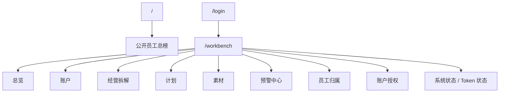

# 02 页面与交互说明

## 1. 页面信息架构

---

## 2. 路由基线

第一阶段统一路由：

- `/`
- `/login`
- `/workbench`
- `/api/*`

第一阶段不再维护：

- 大屏页 `/screen`
- 独立后台 `/admin`

---

## 3. 设计原则

1. 风格接近官方工作台，但不追求复杂特效。
2. 桌面优先，重点照顾老板和运营主管。
3. 表格、排序、筛选、侧栏详情优先。
4. 页面刷新后保留排序与筛选状态。
5. 性能优先，不做无意义动画。

---

## 4. 主看板布局

### 4.1 顶部

- 系统标题
- 当前状态胶囊
- 最近同步状态
- 导航标签
- 轻量操作按钮

目标：

- 头部尽量紧凑
- 不制造无意义留白

### 4.2 总览页

模块顺序：

- 经营主卡
- 活跃度摘要
- 系统状态
- 老板关注

### 4.2A 公开员工榜

- 默认匿名可访问
- 默认按消耗降序
- 支持升序/降序
- 支持今日 / 近 7 天 / 当月 / 自定义
- 默认展示：
  - 排名
  - 归属人名称
  - 总消耗
  - 支付金额
  - 订单量
  - ROI
- 不展开计划和素材明细
- 页面首屏不出现后台配置入口

### 4.3 账户页

- 时间范围 / 自定义时间段
- 排名表格
- 排序
- 搜索

### 4.4 经营拆解页

- 商品排名
- 员工排名
- 时间段切换
- 自定义时间段

### 4.5 计划页

- 左侧计划表格
- 右侧详情侧栏
- 计划字段摘要
- 商品 / 素材摘要

### 4.6 素材页

- 素材榜单
- 视频/素材字段
- 排序和搜索

### 4.7 通知规则页

- 渠道设置
- 阈值规则新增
- 已生效规则表

要求：

- 只保留阈值告警相关配置
- 去掉定时报表、简报配置等无关项
- 先把多通知渠道配置结构做完整，实际发送可以后置开启

### 4.8 员工归属页

- 员工列表
- 关键词规则
- 关键词命中预览
- 人工勾选修正
- 未归属对象池

### 4.9 账户授权页

- 运营账号列表
- 可见账户范围配置
- 授权结果预览

---

## 5. 通用交互规则

### 5.1 时间筛选

所有带 `日 / 周 / 月` 的模块统一支持：

- 日
- 周
- 月
- 自定义时间段

### 5.2 排序

- 点击列头排序
- 自动刷新后保持当前排序方式

### 5.3 搜索与归属

- 搜索只收窄当前结果集
- 不新开第二套“搜索页”
- 员工归属配置页里的搜索结果可直接勾选进入归属关系
- 同一员工可配置多个关键词
- 搜索范围支持：
  - 全部
  - 账户
  - 计划
  - 商品
  - 素材
- 同一关键词命中的账户/计划/商品/素材可人工勾选入员工归属范围

### 5.4 详情

- 优先侧栏或当前页详情
- 不做多层跳转

### 5.5 空值

- 前端统一显示 `--`

---

## 6. 第一阶段不做的页面

- 大屏展示页
- 独立 `/admin` 后台站点
- 多租户配置台
- BI 自定义分析器
